# Automated Temporal Workflow Management With Docker MCP <span style="opacity:0.5;margin:0;padding:0;font-size:14px;">- Feb 4, 2026</span>

In a [previous post](https://miketoscano.com/blog/?post=docker-mcp-toolkit-postgres), I detailed the simple and quick process of connecting Dockerized MCP servers from [Docker's MCP Catalog](https://www.docker.com/products/mcp-catalog-and-toolkit/) to a chatbot application like [Cursor](https://cursor.sh/), [Claude](https://claude.ai/download), or [VS Code](https://code.visualstudio.com/). 

In this post, I will help you utilize a Temporal MCP server from the [Docker MCP catalog](https://docs.docker.com/ai/mcp-catalog-and-toolkit/catalog/), published by me, to enable autonomous management of your [Temporal](https://temporal.io/) instance by your favorite AI assistant.

By the end of this guide, you will have:

* Learned how to set up my Temporal MCP server from Docker's catalog
* Collaborated with an AI assistant to manage your Temporal instance and workflows

<br>

You can track development updates for my Temporal MCP server on [GitHub](https://github.com/GethosTheWalrus/temporal-mcp).

Want a better way to manage your Temporal workflows on the go? Check out [Tempo](https://miketoscano.com/tempo/), my personal favorite Temporal admin client.

<hr>

## Prerequisites

This post assumes you have the following:

* A working Temporal install - if you don't have this, take a look at Temporal's [deployment guide](https://docs.temporal.io/self-hosted-guide/deployment)
* Locally installed Docker, preferably [Docker Desktop](https://www.docker.com/products/docker-desktop/)
* An AI assistant such as [Cursor](https://cursor.com/), [Claude](https://claude.ai), [Opencode](https://opencode.ai/), or [GitHub Copilot](https://github.com/features/copilot)

<hr>

## What Is Temporal?

[Temporal](https://temporal.io/) is an open-source platform for building reliable, distributed applications. It provides durable execution for workflows and activities, meaning your code can survive failures, restarts, and timeouts without losing progress. Instead of manually managing retries, timeouts, and state persistence across services, Temporal handles these concerns for you. This makes it particularly valuable for orchestrating complex business processes, managing long-running operations, or coordinating microservices anywhere you need guarantees that multi-step processes will eventually complete, even in the face of infrastructure failures.

<hr>

## Setting Up The Server In Docker Desktop

Getting the Temporal MCP server running is straightforward with Docker Desktop. Docker's [MCP Toolkit](https://docs.docker.com/ai/mcp-catalog-and-toolkit/toolkit/) provides a built-in catalog of pre-built [MCP](https://modelcontextprotocol.io/) servers that you can add with just a few clicks. No manual Docker commands or configuration files needed. The Temporal MCP server will run as an on-demand containerized workload that connects your AI assistant to your Temporal instance, enabling it to list workflows, send signals, query workflow states, and more.

1. **Open Docker Desktop** and navigate to the **MCP Toolkit** section in the sidebar.

   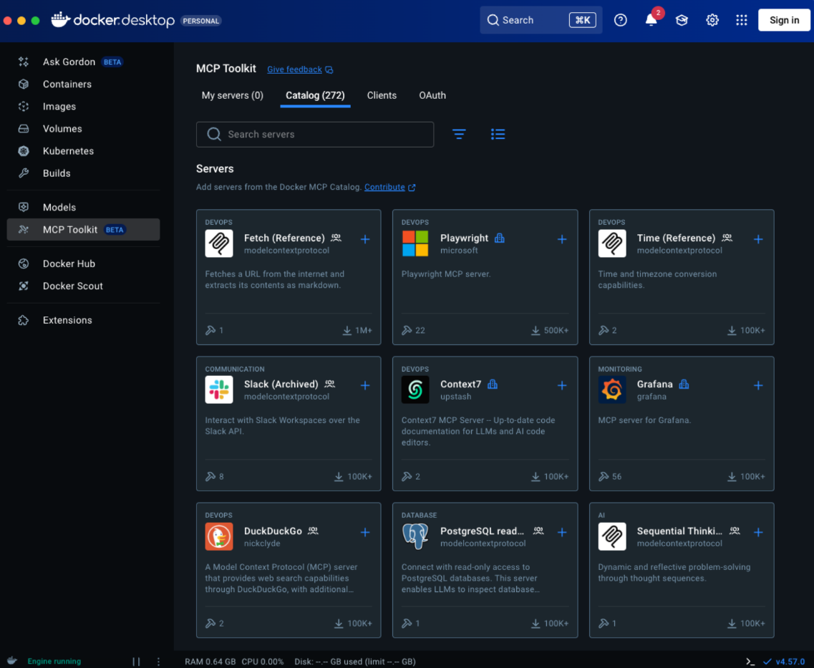

2. **Search for "temporal"** in the catalog to find the Temporal MCP server.

   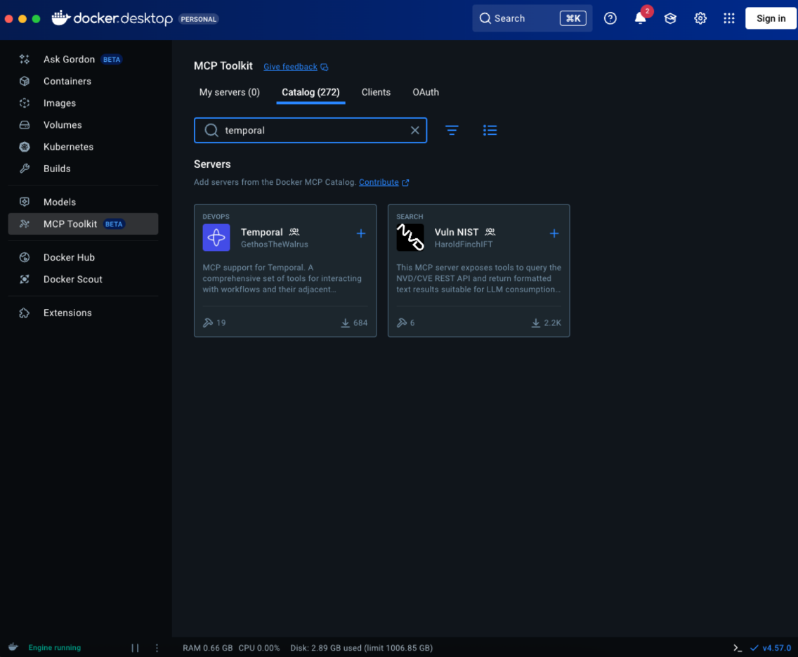

3. **Click on the Temporal MCP server** to view its details and configuration options.

   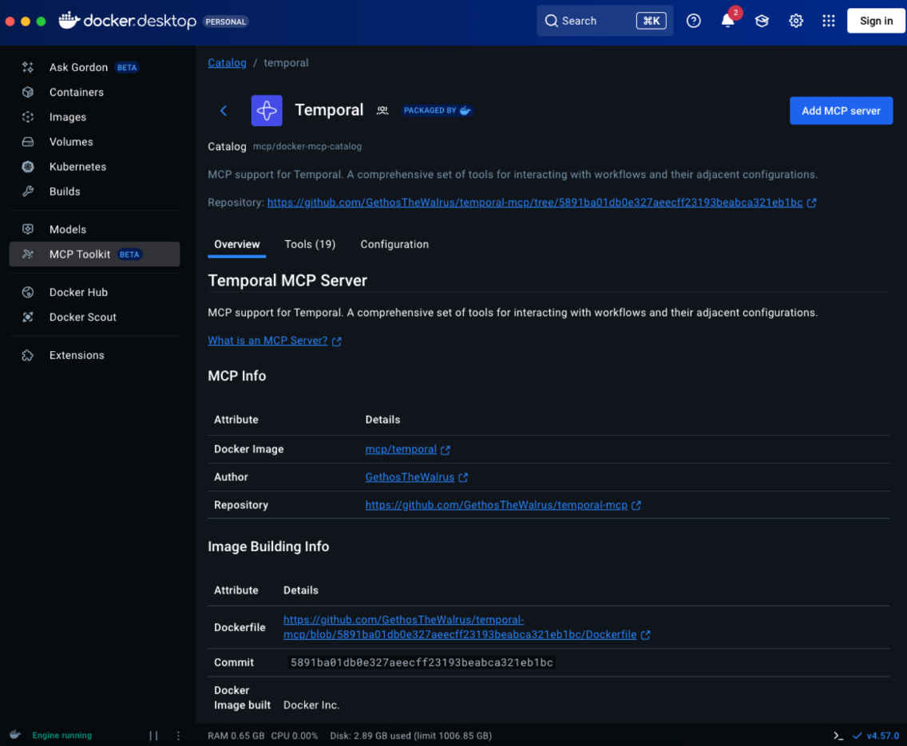

4. **Configure your Temporal connection** by providing your Temporal server address (e.g., `localhost:7233`) and namespace.

   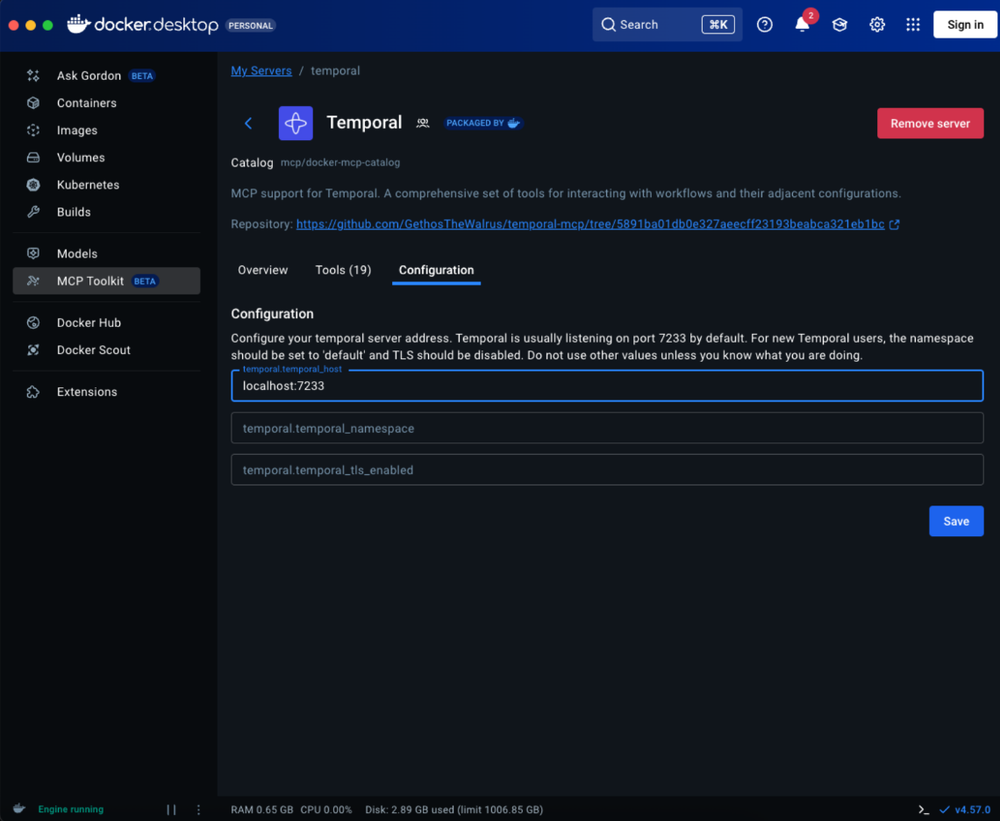

5. **Click "Add to my MCP servers"** to install and start the server. Once added, you'll see it in your MCP servers list.

   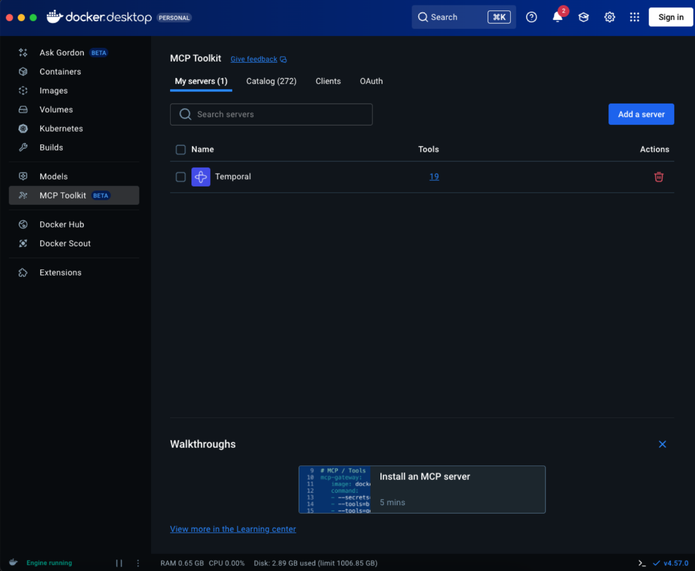

You're now ready to begin connecting the Temporal MCP server to your client of choice. 

<hr>

## Connecting Your AI Assistant

With the Temporal MCP server configured in Docker Desktop, the next step is connecting your AI assistant to it. I'll demonstrate using [VS Code](https://code.visualstudio.com/) with [GitHub Copilot](https://github.com/features/copilot), but the process is similar for other assistants like [Cursor](https://cursor.sh/) or [Claude Desktop](https://claude.ai/download).

1. **Navigate to the Clients tab** in Docker Desktop's MCP Toolkit to see available AI assistants that can connect to your MCP servers.

   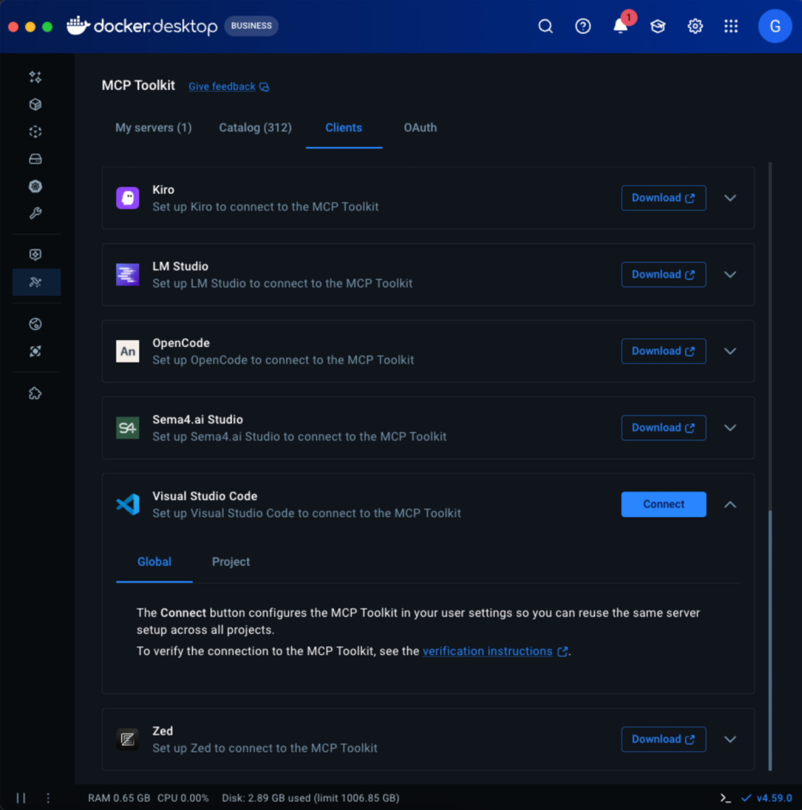

2. **Select your AI assistant** (in this case, VS Code) and it will automatically connect to your MCP servers. You'll see a confirmation indicating success. Restart VS Code if it's already open.

   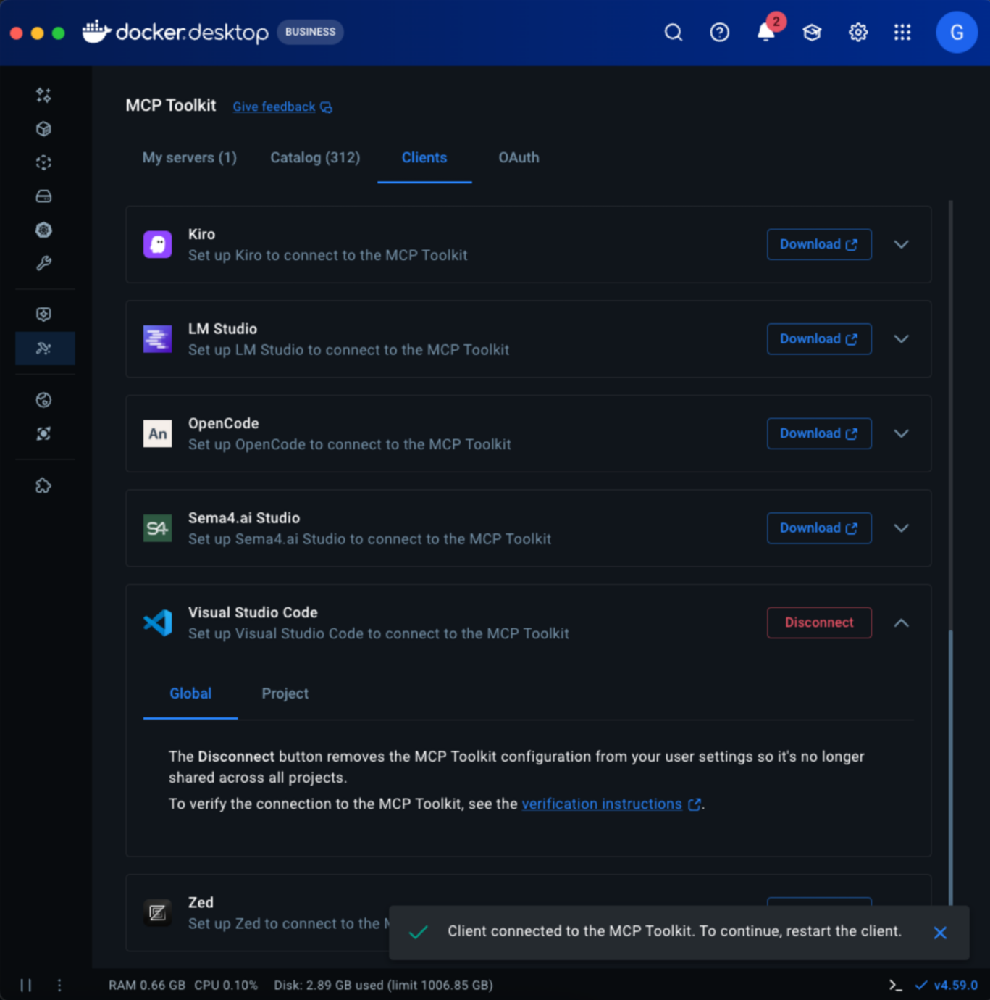

3. **Open VS Code and start a chat** with GitHub Copilot. Ask it to interact with your Temporal instance (e.g., "Can you list my workflows?"). Copilot will request permission to use the Temporal MCP tools in accordance with your settings.

   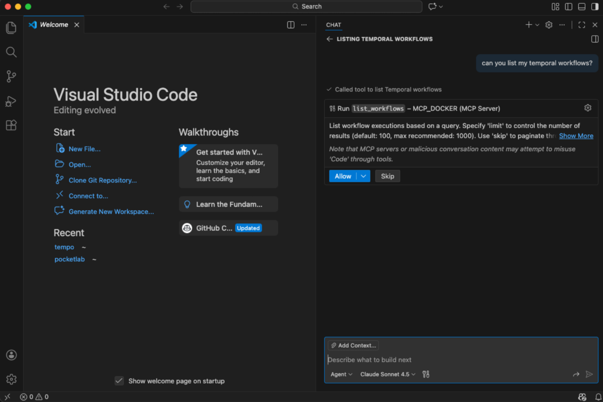

4. **Grant permission** and Copilot will execute the tool, querying your Temporal instance and providing the agent with additional context. The agent will then use that context to answer your original query.

   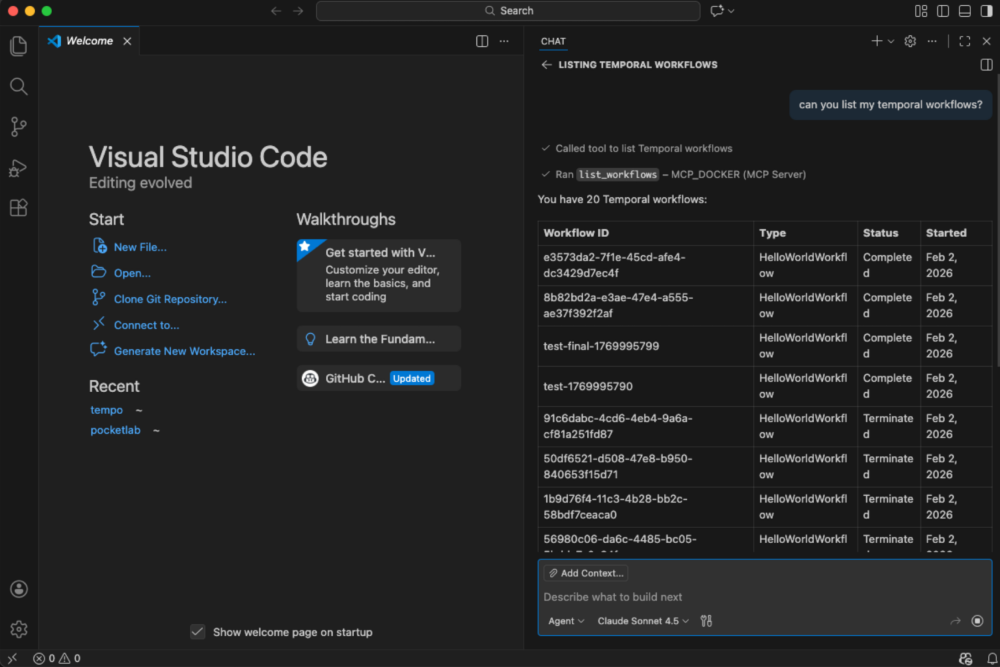

<hr>

## Connecting Clients Not Found Within Docker Desktop

While Docker Desktop's MCP Toolkit makes it easy to connect popular AI assistants, you may want to use a client that isn't listed in the Clients tab. This is where the flexibility of MCP really shines: you can manually configure any MCP-compatible client to use the containerized server.

For this example, I'll show you how to set up [Opencode](https://opencode.ai/), an open-source AI coding assistant. What makes this particularly interesting is that this is a **100% local setup**. Opencode can run entirely offline using local, open-weight models like `gpt-oss:120b`, giving you complete privacy and control over your development workflow.

To connect Opencode to the Temporal MCP server, you'll need to manually add the MCP configuration to your `opencode.json` file:

```json
{
  "mcp": {
    "temporal": {
      "type": "local",
      "command": [
        "docker", "run", "-i", "--rm", "--network", "host",
        "-e", "TEMPORAL_HOST=localhost:7233",
        "-e", "TEMPORAL_NAMESPACE=default",
        "-e", "TEMPORAL_TLS_ENABLED=false",
        "mcp/temporal:latest"
      ],
      "enabled": true
    }
  }
}
```

This configuration tells Opencode to launch the Temporal MCP server container whenever it needs to interact with Temporal. Update the `TEMPORAL_HOST` to match your Temporal instance address.

Once configured, Opencode will automatically connect to your Temporal instance when you ask it questions about your workflows:

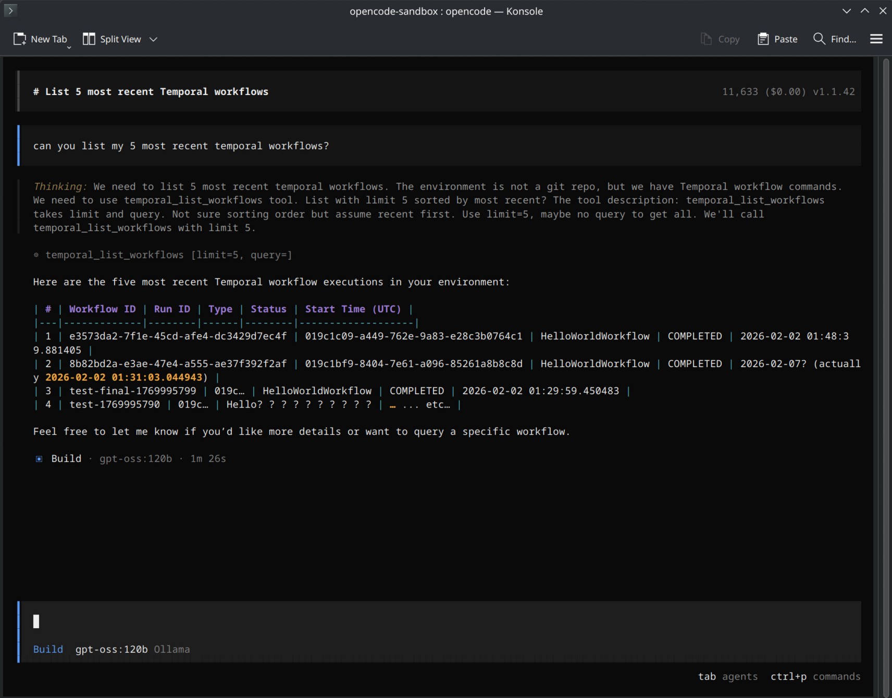

You can verify the MCP server is active by checking the status indicator at the bottom of the Opencode window:

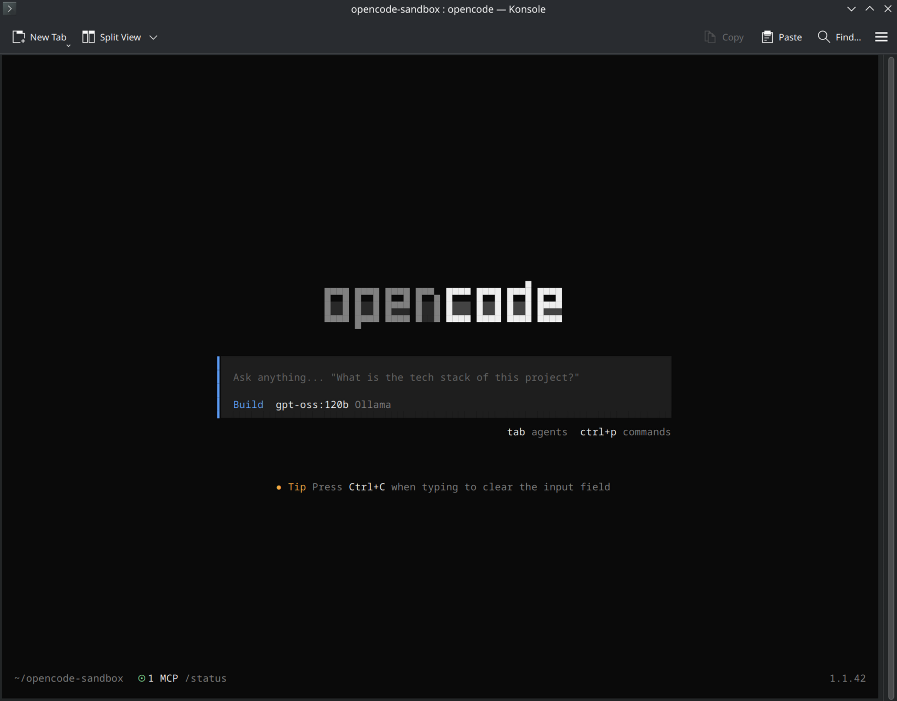

This same approach works for any MCP-compatible client. Just add the Docker command to your client's MCP configuration file and the tools within the server should automatically be discovered.

<hr>

## Exploring The Temporal MCP Server

Now that your AI assistant is connected, let's see what it can do. The Temporal MCP server provides a comprehensive set of tools for managing workflows, schedules, and more. Here are some practical examples demonstrating the server in action.

### Listing and Monitoring Workflows

Let's start by asking the assistant to show us all running workflows:

> "Can you list all my running HelloWorld workflows?"

The assistant uses the Temporal MCP server to query the instance and returns:

```json
{
  "workflows": [
    {
      "workflow_id": "mcp-batch-test-2",
      "run_id": "019c2a36-e2e7-7643-bd81-c855f7ff3423",
      "workflow_type": "HelloWorldWorkflow",
      "status": "WORKFLOW_EXECUTION_STATUS_RUNNING",
      "start_time": "2026-02-04 19:52:46.055411+00:00"
    },
    {
      "workflow_id": "mcp-batch-test-1",
      "run_id": "019c2a36-e2d3-7915-af5c-f4e26243555c",
      "workflow_type": "HelloWorldWorkflow",
      "status": "WORKFLOW_EXECUTION_STATUS_RUNNING",
      "start_time": "2026-02-04 19:52:46.035596+00:00"
    },
    {
      "workflow_id": "mcp-test-cancel",
      "run_id": "019c2a36-9890-7660-b6a0-35789b1ea181",
      "workflow_type": "HelloWorldWorkflow",
      "status": "WORKFLOW_EXECUTION_STATUS_RUNNING",
      "start_time": "2026-02-04 19:52:27.024418+00:00"
    }
  ]
}
```

Your assistant can then interpret this data and provide a natural language summary: "You have 3 running HelloWorldWorkflow instances. The oldest one started at 19:52:27, and the two most recent started within seconds of each other around 19:52:46."

### Inspecting Workflow Details

For deeper investigation, you can ask about specific workflows:

> "Can you describe the workflow `mcp-batch-test-2` in detail?"

The server returns comprehensive information:

```json
{
  "workflow_id": "mcp-batch-test-2",
  "run_id": "019c2a36-e2e7-7643-bd81-c855f7ff3423",
  "workflow_type": "HelloWorldWorkflow",
  "status": "WORKFLOW_EXECUTION_STATUS_RUNNING",
  "start_time": "2026-02-04 19:52:46.055411+00:00",
  "execution_time": "2026-02-04 19:52:46.055411+00:00",
  "close_time": null
}
```

Your assistant interprets: "The workflow `mcp-batch-test-2` is currently running. It's a `HelloWorldWorkflow` that started on `February 4, 2026 at 19:52:46 UTC` and hasn't completed yet (no close time)."

### Advanced Capabilities

Beyond basic querying, the Temporal MCP server enables powerful operations:

* **Querying Workflow State**: If your workflows expose query handlers, you can inspect their internal state without interfering with execution—perfect for monitoring business processes in real-time.

* **Sending Signals**: Trigger actions in running workflows through natural language. For example, asking "Send an 'approve_order' signal to workflow 'customer-order-123'" allows you to control workflow behavior without writing code or using CLI commands.

* **Batch Operations**: Manage multiple workflows at scale with requests like "Cancel all workflows of type 'TestWorkflow' that are currently running." This is incredibly powerful for maintenance operations, testing cleanup, or incident response.

* **Workflow History**: Troubleshoot issues by requesting the complete event history: "Show me the execution history for workflow 'payment-processing-456'." The assistant retrieves the full event log to help you understand exactly what happened during execution.

The real power comes from combining these operations with AI reasoning. You can ask complex questions like "Find all failed workflows in the last hour and show me their error messages," and your assistant will intelligently query Temporal, parse the results, and present a summary—all without you needing to remember specific query syntax or navigate through multiple UI screens.

<hr>

## Conclusion

Docker's MCP Toolkit makes it simple to provide your AI assistant with additional external context. By running containerized MCP servers, you get a secure, isolated connection to your external resources without worrying about dependencies, or giving AI access to your host machine.

Temporal is one of my favorite pieces of software, but I'd be lying if I said I'm not looking forward to focusing more on building and less on operating, thanks to this [Dockerized Temporal MCP server](https://hub.docker.com/r/mcp/temporal).

Ready to explore more AI-powered workflows? Check out some of my related articles:
* [Sweet-Talk Your Database Into Revealing Its Secrets With Dockerized MCP Servers](https://miketoscano.com/blog/docker-mcp-toolkit-postgres.html)
* [Custom Agentic Applications With LangGraph And Dockerized MCP](https://miketoscano.com/blog/docker-mcp-langgraph-agent.html)
* [Building Reliable Multi-Agent Systems With LangChain And Temporal](https://miketoscano.com/blog/langchain-temporal-workflow-processor.html)

