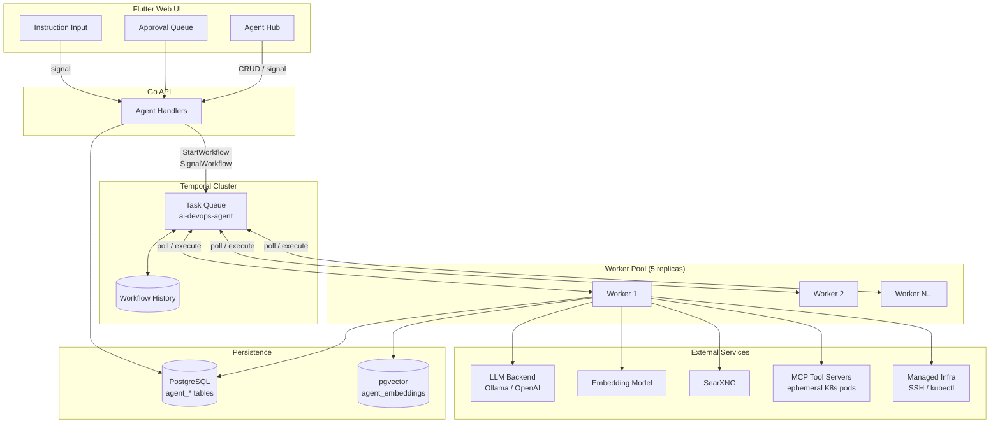
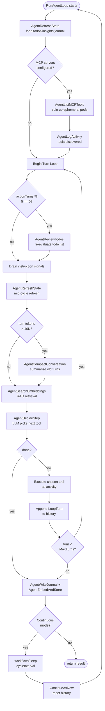
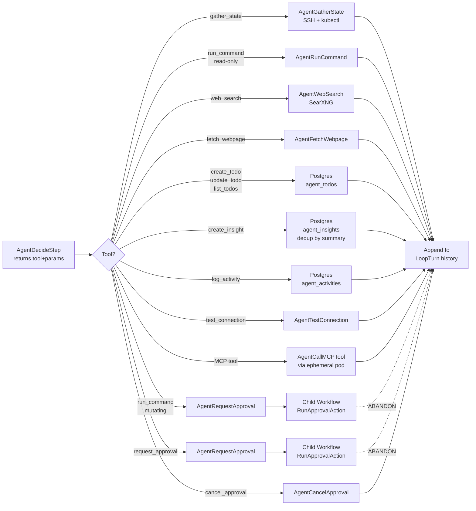
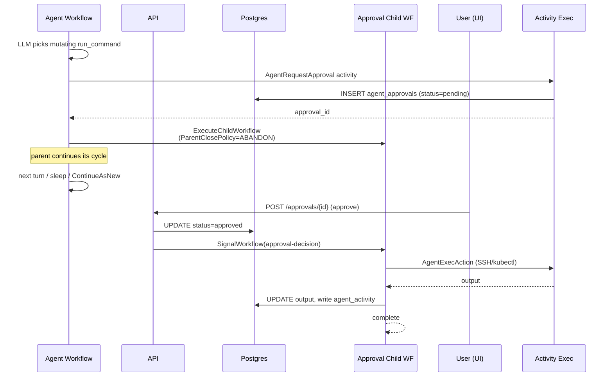
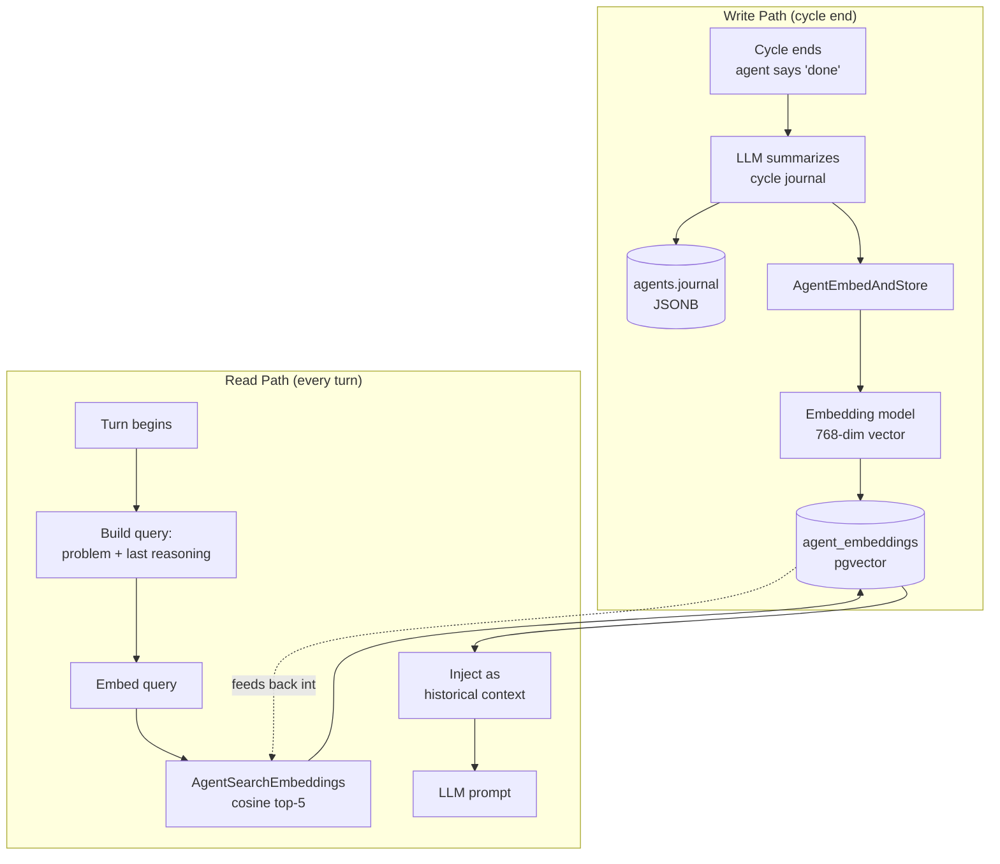
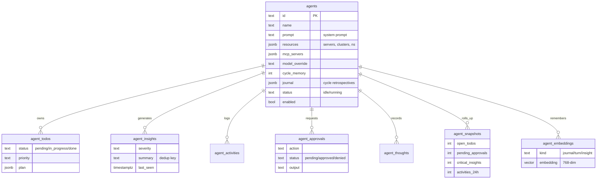
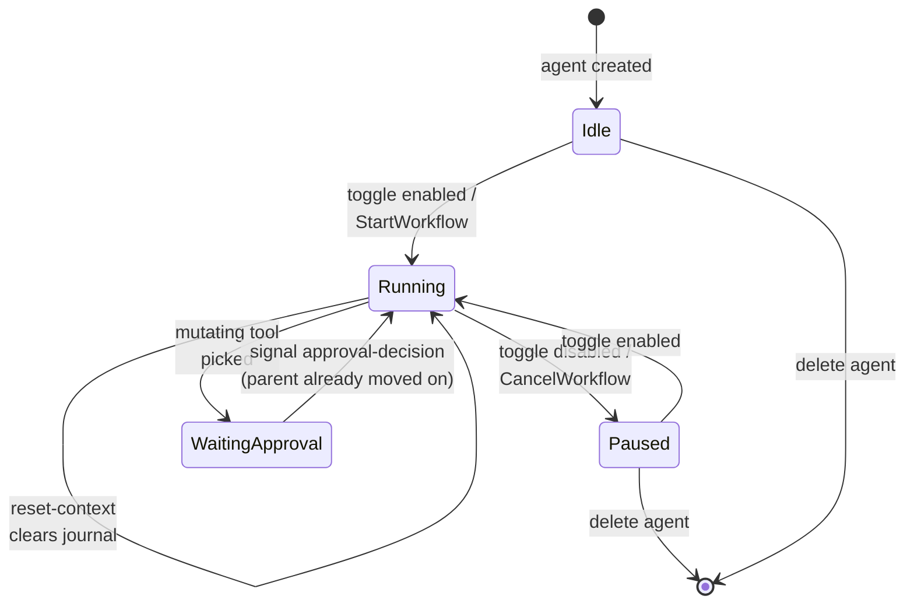

# How Agent Hub Works: AI DevOps Agents That Actually Run Your Infrastructure

## 1. Intro — What is Agent Hub?
- The problem: dashboards tell you *what's* wrong; agents act on it
- Agent Hub = a fleet of long-running, domain-scoped AI agents inside the AI DevOps platform
- Each agent owns a slice of infrastructure (servers, clusters, namespaces) with its own prompt, memory, todos, and approval queue
- Preview screenshot: the Agent Hub overview page

## 2. How the Agents Run
- Every agent is a **Temporal workflow** (`RunAgentLoop`), not a background goroutine or cron job
- Two run modes:
  - **Continuous** — workflow loops forever, sleeping a configurable `cycle_interval` between cycles
  - **Manual / bounded** — runs up to `MaxTurns` then exits (for one-off analyses)
- Inside a cycle, each turn = LLM decision → tool execution → result appended to turn history
- `ContinueAsNew` at the end of every cycle to keep Temporal history bounded (critical for agents that run for weeks)
- Workers poll the `ai-devops-agent` Temporal task queue; horizontal scale = more worker replicas (we run 5)
- Diagram: API → starts workflow → Temporal → dispatches to Worker → executes activities

## 3. How the Agents Know What to Do
- **Agent definition** (`agents` table): name, description, system prompt, resources (server IDs, control planes, namespaces), model override, MCP servers, cycle memory depth
- **Existing state** refreshed from DB at each cycle start and between turns — todos, insights, open approvals, journal
- **RAG retrieval**: every turn, the problem + last reasoning are embedded and matched against `agent_embeddings` (pgvector, 768-dim) to pull relevant historical context
- **MCP tool discovery**: if the agent has MCP servers configured, they're spun up as ephemeral pods on a designated K8s control plane and their tools become callable tools in the LLM prompt
- The `AgentDecideStep` activity sends system prompt + tools + state + RAG + recent turns to the LLM and gets back `{tool, reasoning, params}` or `{done: true, summary}`

## 4. The Tool Catalog (How Agents Take Action)
- Read-only tools: `gather_state`, `list_todos`, `test_connection`, `run_command` (if read-only), `web_search`, `fetch_webpage`
- State-mutating tools: `create_todo`, `update_todo`, `create_insight`, `log_activity`
- **Gated tools** (require human approval): mutating `run_command`, `request_approval`, any MCP tool flagged destructive
- Approvals use Temporal child workflows (`RunApprovalAction`) with `ParentClosePolicy: ABANDON` — they wait up to 24 h for a signal from the UI, independent of the parent's lifetime
- Each tool call is its own Temporal activity → automatic retries, timeouts, and full replay history

## 5. How the Agents Keep Track of Their Work
- Postgres-backed persistent state, per-agent-scoped:
  - `agent_todos` — planned work with status, priority, plan steps
  - `agent_insights` — recurring findings (dedup'd by summary, severity upgrades tracked)
  - `agent_activities` — audit log of every action (including MCP tool discovery, failures)
  - `agent_approvals` — pending/approved/denied mutating actions
  - `agent_thoughts` — raw turn-by-turn reasoning + tool I/O
  - `agent_snapshots` — time-series metric rollups
  - `agent_embeddings` — pgvector-backed long-term memory
  - `agents.journal` — LLM-summarized cycle retrospectives
- **Conversation compaction**: when turn history exceeds ~40K tokens, older turns are summarized in place by a dedicated `AgentCompactConversation` activity
- **Todo review**: every 5 action turns, a dedicated review step re-evaluates whether todos are still relevant
- **Cycle journal**: at cycle end, a summary is written to the journal *and* embedded for future RAG retrieval

## 6. How Users Steer the Agents
- **System prompt / description / resources** — define the agent's personality and scope at creation
- **Live instruction signals**: UI sends a Temporal signal (`agent-instruction`) → drained at the start of each turn → appended to the prompt without restarting the workflow
- **Toggle enabled/disabled** — cleanly stops or starts the workflow
- **Reset context** — clears journal / state to break out of a rut
- **Approval queue** — every destructive action is a human-in-the-loop checkpoint
- **Model override** — choose different LLMs per agent (a bigger model for the "critical incident" agent, a cheaper one for the "housekeeping" agent)
- **MCP server config** — attach/detach capability packs at runtime
- **Cycle interval & cycle memory** — control how often it wakes and how much history it carries forward

## 7. Metrics & Observability
- `agent_snapshots` captures hourly rollups: open todos, completed todos, pending approvals, active/critical/warning insights, activities over 24 h
- Surfaced in UI as time-series charts per agent and in the aggregate `GET /api/agents/overview` endpoint
- Per-agent activity feed (`/activities`), thoughts feed (`/thoughts`), insights (`/insights`), approvals (`/approvals`)
- Temporal Web UI for workflow-level observability (stuck activities, retry counts, replay)
- Cross-agent pending-approval dashboard (`/api/agents/pending-approvals`)

## 8. Tech Stack & Why
- **Go** workers and API — one static binary, predictable memory, fast SSH/K8s clients
- **Temporal** — the linchpin (dedicated section below)
- **PostgreSQL + pgvector** — single datastore for state *and* embeddings (no separate vector DB)
- **Ollama / OpenAI-compatible backends** — pluggable LLM layer; agents can mix providers
- **SearXNG** — private, attribution-friendly web search when agents need to look up CVEs or error messages
- **MCP (Model Context Protocol)** — standard way to plug in domain-specific tool servers without rebuilding the worker
- **Flutter web UI** — rich dashboards, real-time activity feeds, approval prompts
- **SSH-only, agentless** infra footprint — agents don't need anything installed on target servers
- **Kubernetes + Helm** — workers scale horizontally to match agent count

## 9. Deep Dive: How Temporal Makes This Possible

### 9.1 Durability
- An agent workflow runs for weeks. Worker crash? Node drain? Deploy? Temporal replays history and the agent picks up exactly where it left off — mid-turn, mid-tool-call.

### 9.2 Every tool call is an activity
- Automatic retries with `RetryPolicy`
- Independent timeouts (LLM: 45 min; tools: 30 min)
- Activities run on any worker in the pool — natural load balancing

### 9.3 `ContinueAsNew` for unbounded loops
- Without it, a continuous agent's history would grow forever and eventually break Temporal
- We call it at the end of every cycle, carrying forward only the input — history starts fresh while the agent *semantically* keeps going

### 9.4 Signals for steering
- Users send `agent-instruction` signals mid-flight; the workflow drains them at safe points
- Approvals use signal channels too — the approval child workflow blocks until the UI signals `approval-decision`

### 9.5 Child workflows for async approvals
- A 24-hour approval wait can't block the parent — so it's a `ParentClosePolicy: ABANDON` child
- Parent agent continues its cycle; child independently executes the action when approved

### 9.6 Horizontal scaling by task queue
- All agents share the `ai-devops-agent` task queue
- Add worker pods → more concurrent agents, zero config change
- One noisy agent can't starve others because activities are interleaved

### 9.7 Full audit trail, for free
- Every agent decision, tool invocation, and result is in Temporal history — replayable, debuggable, auditable

## 10. Putting It All Together — A Day in the Life of an Agent
Walk through a concrete example:
1. Cycle wakes, refreshes state from DB, runs RAG query
2. Discovers MCP tools from the configured K8s MCP server
3. LLM decides: `gather_state` across 3 servers
4. Sees high memory on `db-01`, decides to `create_todo` and `create_insight`
5. LLM proposes `run_command: systemctl restart postgres-exporter` — auto-gated, creates approval
6. User approves in UI → child workflow signals → command runs → activity logs result
7. Agent marks `done`, writes journal, embeds it, sleeps, `ContinueAsNew`
8. Next cycle: RAG surfaces yesterday's journal entry, agent knows it already restarted the exporter and doesn't repeat

## 11. Lessons Learned / Future Work
- Token budget management is a must at scale — compaction + RAG beat ever-bigger context windows
- MCP turned what would have been a huge built-in tool catalog into a plugin architecture
- Temporal is overkill for a cron job and exactly right for a long-lived agent
- Next up: multi-agent collaboration via shared insights bus, agent-initiated code changes via PRs, voice-driven steering

## 12. Links
- Repo / screenshots / Helm chart / demo video

---

## Diagrams

### 1. High-Level Architecture

### 2. Agent Loop Workflow (one cycle)

### 3. Single-Turn Tool Dispatch

### 4. Human-in-the-Loop Approval Flow

### 5. RAG Memory Pipeline

### 6. State Model (per agent)

### 7. User Steering & Lifecycle Signals

